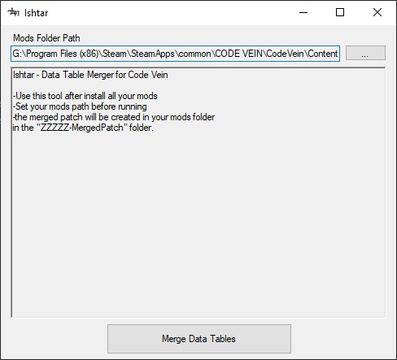

# Ishtar
 
Simple Data Table Merger for Code Vein

# Usage
Ishtar is used for creating a merged patch for mods that edit certain data tables in Code Vein. This allows multiple mods that add standalone outfits, masks, accessory, ect to work together without issue. Ishtar contains it's own logs of vanilla data tables to work off so there's no need to extract your own.
- Select your ~mods folder in the path at the top
- Press the "Merge Data Tables" button to begin merging
- The merged patch will be made in `~mods\ZZZZZ-MergedPatch\ZZZZZ-MergedPatch_P.pak` and will overwrite an existing patch

# Dependencies
- [.NET Framework 4.8](https://dotnet.microsoft.com/download/dotnet-framework)  

# Credits
[QueenIO](https://github.com/VelouriasMoon/QueenIO)  
[UAssetAPI](https://github.com/atenfyr/UAssetAPI)

Made Using QueenIO:

    
    

